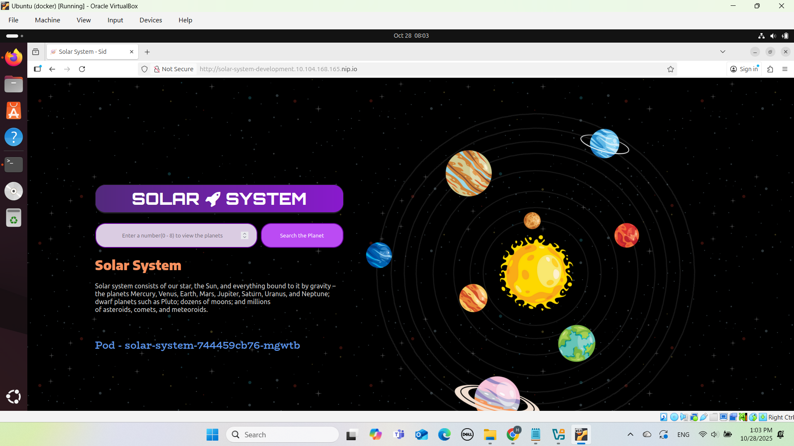
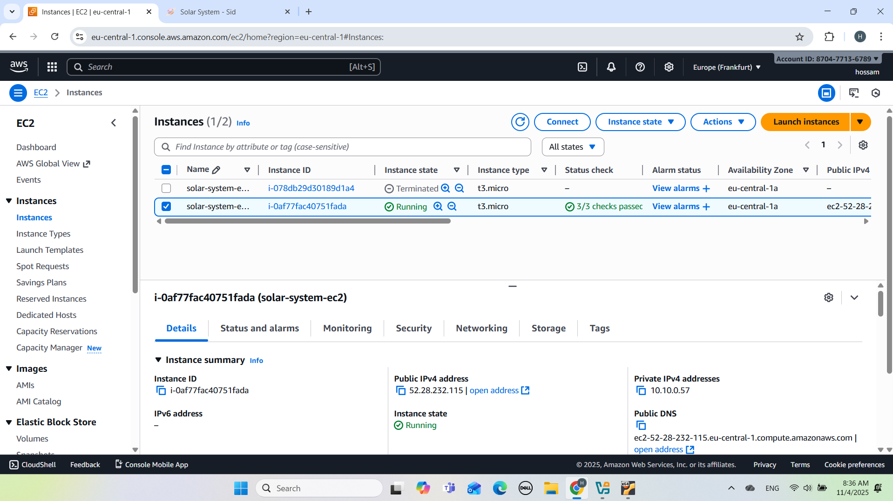
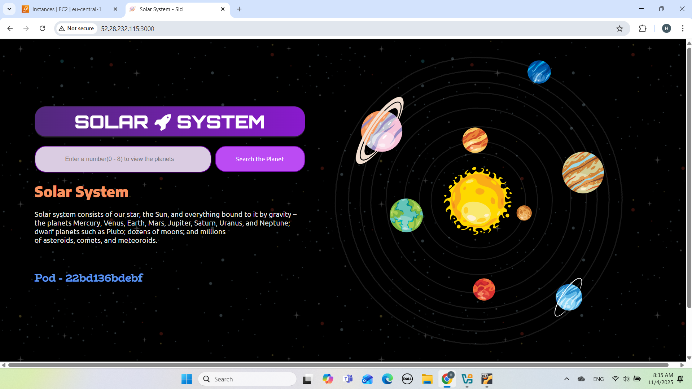

#  DevOps Project Series: Solar System Web Application

This repository showcases a series of **DevOps projects** designed around a single web application — **“Solar System”**, a simple Node.js app containerized with Docker and deployed through automated pipelines and Infrastructure as Code.

Each project focuses on a different DevOps skillset — from CI/CD automation to infrastructure provisioning — demonstrating hands-on proficiency with modern cloud and DevOps tools.


---


## Project 1: Solar System Web App — CI/CD on Kubernetes (Minikube + GitHub Actions)

A containerized **Node.js web application** deployed to a **Kubernetes cluster (Minikube)** on a local machine, with a complete **CI/CD pipeline using GitHub Actions**.

This project demonstrates real-world DevOps workflows — including Dockerization, Kubernetes deployment automation, secrets management, and ingress routing — built from scratch.


---


## Features

- **Automated CI/CD** using GitHub Actions
- **Containerized Node.js** application (Docker)
- **Kubernetes deployment** on local Minikube cluster
- **Ingress routing** via NGINX Ingress Controller with LoadBalancer tunnel
- **Environment variables & secrets** securely managed via GitHub Secrets/Variables
- **Automated MongoDB Secret creation**
- **Namespace-based isolation** for environments (e.g., `development`)
- **Self-hosted runner** integration for local Kubernetes operations


---


## Tech Stack

| Layer | Tool / Service | Purpose |
|-------|----------------|----------|
| CI/CD | **GitHub Actions** | Build, push, deploy |
| Container | **Docker** | Containerize Node.js app |
| Orchestration | **Kubernetes (Minikube)** | Local cluster for deployment |
| Routing | **NGINX Ingress Controller** | External access via LoadBalancer tunnel |
| Secrets | **kubectl Secrets + GitHub Secrets** | Secure credentials |
| Database | **MongoDB** | App backend data |
| OS / Runner | **Ubuntu VM (Self-Hosted Runner)** | Executes pipeline jobs locally |


---


## GitHub Actions Workflow

### Workflow File: `.github/workflows/deploy.yaml`

The pipeline automates the entire process:

1. **Build & Push Docker Image**
   - Checks out repository
   - Builds Docker image
   - Pushes it to DockerHub and GHCR

2. **Deploy to Kubernetes**
   - Runs on a **self-hosted Ubuntu runner**
   - Uses `kubectl` to apply Kubernetes manifests (deployment, service, ingress)
   - Creates MongoDB secret dynamically
   - Verifies the cluster and deployment state

#### Example Job Steps 
```yaml
jobs:
  docker:
    runs-on: ubuntu-latest
    steps:
      - uses: actions/checkout@v4
      - name: Build & Push Docker image
        run: |
          docker build -t ${{ secrets.DOCKER_USERNAME }}/solar-system:${{ github.sha }} .
          docker push ${{ secrets.DOCKER_USERNAME }}/solar-system:${{ github.sha }}

  dev-deploy:
    needs: docker
    runs-on: [self-hosted, ubuntu-vm]
    steps:
      - uses: actions/checkout@v4
      - uses: azure/setup-kubectl@v4
        with:
          version: 'v1.34.1'
      - name: Configure Kubeconfig
        run: |
          mkdir -p ~/.kube
          cp /home/osboxes/.kube/config ~/.kube/config
      - name: Create MongoDB Secret
        run: |
          kubectl -n ${{ vars.NAMESPACE }} create secret generic mongo-db-creds \
          --from-literal=MONGO_URI=${{ env.MONGO_URI }} \
          --from-literal=MONGO_USERNAME=${{ vars.MONGO_USERNAME }} \
          --from-literal=MONGO_PASSWORD=${{ secrets.MONGO_PASSWORD }} \
          --dry-run=client -o yaml | kubectl apply -f -
      - name: Apply Kubernetes Manifests
        run: |
          kubectl apply -f k8s/deployment.yaml -n ${{ vars.NAMESPACE }}
          kubectl apply -f k8s/service.yaml -n ${{ vars.NAMESPACE }}
          kubectl apply -f k8s/ingress.yaml -n ${{ vars.NAMESPACE }}
      - name: Verify Deployment
        run: |
          kubectl get pods -n ${{ vars.NAMESPACE }}
          kubectl get svc -n ${{ vars.NAMESPACE }}
          kubectl get ingress -n ${{ vars.NAMESPACE }}


---


## Ingress Configuration

Example ingress.yaml:

apiVersion: networking.k8s.io/v1
kind: Ingress
metadata:
  name: solar-system-ingress
  namespace: development
  annotations:
    nginx.ingress.kubernetes.io/rewrite-target: /
spec:
  rules:
    - host: solar-system.local
      http:
        paths:
          - path: /
            pathType: Prefix
            backend:
              service:
                name: solar-system
                port:
                  number: 3000

```


### Kubernetes Components


| Component                  | Kind                  | Description                        |
| -------------------------- | --------------------- | ---------------------------------- |
| `solar-system`             | Deployment            | Runs Node.js app in pods           |
| `solar-system`             | Service (`ClusterIP`) | Internal entrypoint for ingress    |
| `solar-system-ingress`     | Ingress               | Routes external traffic to service |
| `mongo-db-creds`           | Secret                | Stores database credentials        |
| `ingress-nginx-controller` | LoadBalancer          | External access point (via tunnel) |


---


##  Application Preview

Here’s a screenshot of the deployed application running locally inside the Minikube cluster:




-------


## How to Access the App


1- Expose the ingress controller

kubectl -n ingress-nginx edit svc ingress-nginx-controller
- Change "type: NodePort" to "type: LoadBalancer"

2- Run tunnel
sudo -E minikube tunnel

3- Get external IP
kubectl -n ingress-nginx get svc ingress-nginx-controller

4- Add host entry
sudo nano /etc/hosts
- Add line:
- <EXTERNAL-IP>  solar-system.local

5- Visit
http://solar-system.local


---


## Repository Secrets and Variables


| Name              | Type        | Example               | Description               |
| ----------------- | ----------- | --------------------- | ------------------------- |
| `DOCKER_USERNAME` | Secret      | yourdockeruser        | DockerHub username        |
| `DOCKER_PASSWORD` | Secret      | ********              | DockerHub password/token  |
| `MONGO_PASSWORD`  | Secret      | ********              | MongoDB password          |
| `NAMESPACE`       | Variable    | development           | Kubernetes namespace      |
| `MONGO_USERNAME`  | Variable    | mongoUser             | MongoDB username          |
| `MONGO_URI`       | Environment | mongodb://mongo:27017 | MongoDB connection string |


---


## Results & Verification


✅ CI/CD pipeline runs automatically on push

✅ Docker image built & stored successfully

✅ Deployment auto-updates in Minikube

✅ External access verified via Ingress tunnel

### You can view pipeline runs under Actions tab in GitHub.


---


## Key DevOps Concepts Demonstrated


- GitHub Actions automation

- Kubernetes declarative deployment

- Secrets & environment isolation

- Ingress & LoadBalancer concepts

- Local cluster tunneling (Minikube)

- CI/CD integration with self-hosted runner


---


##  Project 2: Infrastructure as Code (IaC) with Terraform

**Description:**  
This project provisions AWS infrastructure using **Terraform** to deploy the same Node.js "Solar System" web application from Project 1.  
It automates the creation of an EC2 instance, security groups, networking configuration, and application deployment — all through code.


---


###  Project Overview
- **Infrastructure Automation:** Defined using Terraform scripts (`main.tf`, `variables.tf`, `outputs.tf`, `provider.tf`)
- **Deployment:** Node.js Docker container automatically runs on the EC2 instance after provisioning
- **State Management:** Terraform remote state managed securely
- **Configuration:** Security groups allow controlled access to the app via HTTP
- **Reusability:** Variables and outputs defined for flexibility and clarity
- ****Note: For security, credentials are parameterized. In a real-world deployment, these would be securely managed using AWS Systems Manager Parameter Store or Secrets Manager.


---


###  Key Technologies
- **Terraform** – Infrastructure as Code tool  
- **AWS EC2** – Virtual machine hosting the application  
- **AWS Security Groups** – Access control and networking configuration  
- **Docker** – Containerized Node.js app deployment  
- **Linux User Data Scripts** – Automates app start on boot  


---


###  Infrastructure Design
The Terraform configuration performs the following:
1. Provisions an EC2 instance with an attached security group.  
2. Installs Docker on the instance and pulls the “Solar System” app image.  
3. Exposes the app to the internet through port 3000.  
4. Outputs the public IP for direct browser access.  


---


###  Testing & Validation
- Verified successful instance creation via AWS Management Console  
- Confirmed app accessibility using the public IP address  
- Validated Docker container auto-starts on reboot  
- Confirmed Terraform destroy removes all resources cleanly  


---


###  Screenshots
  
  
  
  


---


###  Learning Outcome
- Mastered writing modular Terraform configurations  
- Understood how to automate infrastructure provisioning    
- Improved understanding of Infrastructure as Code (IaC) best practices  


---


 ## Author

#### Hossam Darwish
#### Aspiring Cloud & DevOps Engineer
#### Berlin, Germany


